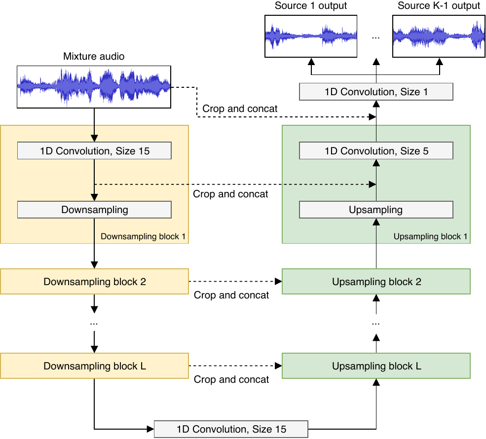

# Wave-U-Net pytorch

Pytorch implementation of [Wave-U-Net: A Multi-Scale Neural Network for End-to-End Audio Source Separation](https://arxiv.org/abs/1806.03185)

## Requirements
- pytorch >= 1.0.0
- pyyaml >= 3.13

## File descriptions
  * `waveunet.py` : contains pytorch implementaion of Wave-U-Net (M4 model in paper)
  * `hparams.yaml` : includes hyper parameters. 

## Training and Test
  * To be added. 

## Comments
  * Any comments for the codes are always welcome.

